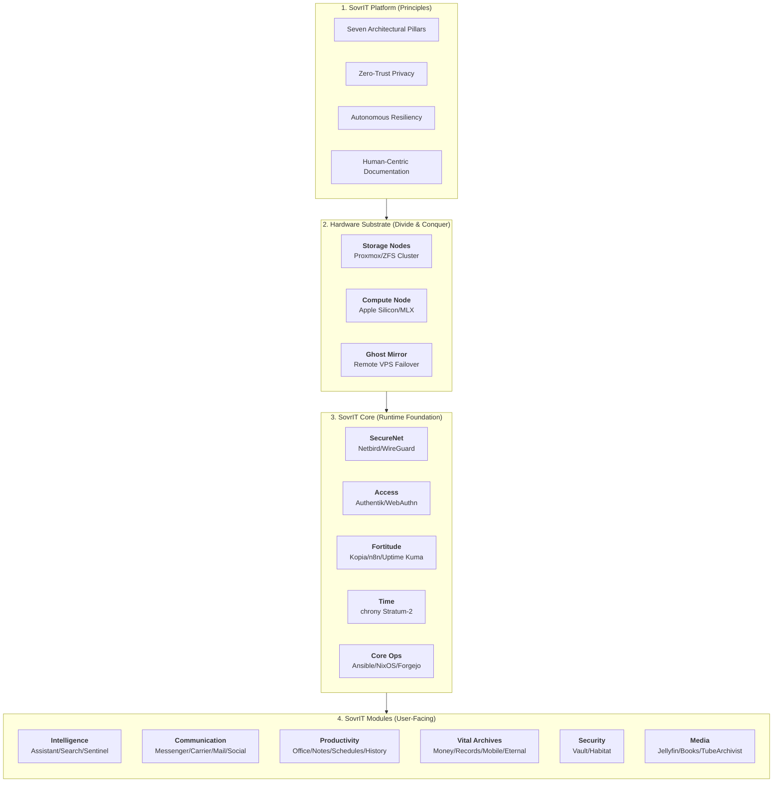

# SovrIT Architecture

This document provides a conceptual and visual overview of the SovrIT Platform, Core substrate, and Functional Modules. It defines how sovereign data flows through the system and how the infrastructure is physically distributed.

---

## 🧩 High‑Level Architecture

---

## 🏗️ Architectural Layers

### 1. SovrIT Platform
The conceptual layer. It dictates the "why" behind the infrastructure. Every integration must adhere to the **Seven Architectural Pillars**, specifically focusing on **Decoupled Encryption** and **Operational Continuity** (The Living Handbook).

### 2. Hardware Substrate
A bifurcated hardware strategy designed for maximum performance and minimum power draw:
* **The Heart (Storage):** A 3-node HA cluster (Proxmox/Thin Clients) managing ZFS pools and the **Ghost Mirror** failover.
* **The Brain (Compute):** A dedicated Apple Silicon node utilizing Unified Memory for "hot" AI inference and universal indexing.

### 3. SovrIT Core
The "Runtime Substrate" that provides the invisible services required for the modules to function:
* **Identity & Security:** **Authentik** provides a single OIDC/SAML source of truth for every module, protected by **WebAuthn** biometrics.
* **Resiliency:** **Fortitude** manages automated self-healing pipelines and immutable backups.
* **Networking:** **SecureNet** creates a peer-to-peer mesh that renders the system invisible to the public internet.

### 4. SovrIT Modules
The functional applications. These are containerized or virtualized services that provide the actual utility to the household. 
* **Sovereign Intelligence:** Local AI (**Assistant**) is natively integrated with the universal search index (**Meilisearch**), allowing the system to "know" your records without cloud data leakage.
* **Communication:** A unified hub (**Matrix**) and encrypted telephony (**VitalPBX**) bridge the sovereign mesh to external networks.
* **Vital Archives:** Specialized modules for life management, from financial auditing (**Money**) to the digital dead-man switch (**Eternal**).

---

## 🔐 Data Flow & Security
1.  **Ingress:** Data enters via local sensors (Habitat), mobile capture (Mobile/Money), or the Messenger bridges.
2.  **Processing:** The **Compute Node** performs OCR, AI transcription, or indexing.
3.  **Storage:** Processed data is written to **ZFS** encrypted pools on the **Storage Nodes**.
4.  **Resilience:** **Kopia** captures an immutable snapshot of the ZFS pool and ships it to offsite S3 storage.
5.  **Failover:** If the local cluster goes offline, the **Ghost Mirror** VPS orchestrates access to critical Identity and Vault services via the mesh.
